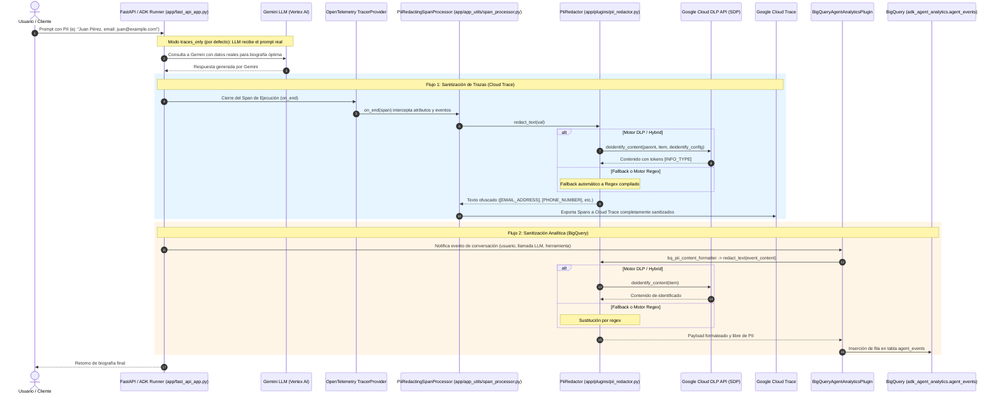

# Arquitectura del Agente (`bio-agent`) 🏛️

El agente **`bio-agent`** es una aplicación agentic construida con **Google ADK 2.0 (Agent Development Kit)**, desplegada en **Google Cloud Run** e instrumentada con observabilidad nativa para Google Cloud Platform.

### 🎯 Propósito y Demostrador de Privacidad
El propósito arquitectónico fundamental de este proyecto es servir como **arquitectura de referencia sobre cómo capturar trazas conversacionales completas en Google Cloud Trace (OpenTelemetry) y analítica en Google BigQuery, asegurando la ofuscación estricta de cualquier dato sensible (PII)** mediante **Google Cloud Sensitive Data Protection (Cloud DLP / SDP)** y fallback local a Regex.

El principio rector del diseño es la **separación de responsabilidades**:
* **El Agente opera sin censura en memoria**: El LLM (Gemini) recibe el prompt real del usuario para que sus capacidades cognitivas y herramientas (`google_search`) funcionen con fidelidad factual.
* **La Ofuscación actúa en la frontera de observabilidad y almacenamiento**: Antes de emitir las trazas hacia Cloud Trace o insertar registros en BigQuery, los componentes de integración interceptan y sustituyen nombres, correos, teléfonos y números de identificación por marcadores estándar (`[PERSON_NAME]`, `[EMAIL_ADDRESS]`, etc.).


---

## Diagrama de Arquitectura

```mermaid
graph TD
    subgraph Cliente / Interfaz
        A[curl / REST Client / CLI] -->|HTTPS + Bearer Token| B[Cloud Run: bio-agent]
    end

    subgraph Servidor FastAPI / ADK 2.0
        B --> C[FastAPI App app/fast_api_app.py]
        C --> D[ADK 2.0 Runner / Agent app/agent.py]
        D --> E[Modelo: Gemini Flash Latest]
        D --> F[Tool: Google Search Grounding]
    end

    subgraph Gestión de Sesiones
        C -->|agentengine://| G[Vertex AI Agent Platform Sessions]
        G --> H[Reasoning Engine: bio-agent-session-engine]
    end

    subgraph Telemetría y Analítica (Observabilidad)
        D -->|OpenTelemetry| I[Google Cloud Trace]
        C -->|Cloud Logging SDK| J[Google Cloud Logging]
        D -->|BigQuery Analytics Plugin| K[BigQuery: adk_agent_analytics]
        K --> L[Tabla: agent_events & Vistas BI]
    end
```

---

## Componentes Principales

### 1. Núcleo del Agente ([`app/agent.py`](app/agent.py))
- **Framework**: ADK 2.0 (`google-adk`).
- **Modelo**: `gemini-flash-latest` (vía Vertex AI).
- **Herramientas de Búsqueda**: `google_search` para fundamentación factual (grounding).
- **Plugins**: [`BigQueryAgentAnalyticsPlugin`](app/plugins/bigquery_analytics_plugin.py#L47-L80) para captura analítica en tiempo real y opcionalmente [`PiiRedactionPlugin`](app/plugins/pii_redactor.py) según el modo configurado.


### 2. Servidor Backend ([`app/fast_api_app.py`](app/fast_api_app.py))
- **Framework**: FastAPI wrappers de ADK (`get_fast_api_app`).
- **Endpoints Expuestos**:
  - `POST /run`: Ejecución de prompts sobre sesiones.
  - `POST /apps/app/users/{user_id}/sessions`: Creación de sesiones.
  - `GET /health` & `/version`: Verificación del servicio.


### 3. Servicio de Sesiones Persistentes ([`app/app_utils/ensure_session_engine.py`](app/app_utils/ensure_session_engine.py))
- **Módulo**: `VertexAiSessionService` de ADK.
- **Detección Automática**: El script [`ensure_session_engine.py`](app/app_utils/ensure_session_engine.py) busca una instancia de Reasoning Engine con `display_name='bio-agent-session-engine'`. Si no existe, la crea la primera vez y reutiliza la URI (`agentengine://...`) en despliegues subsecuentes.

---

### 4. Arquitectura de Observabilidad y Ofuscación PII

El sistema implementa un esquema de doble barrera de ofuscación orquestado por el módulo central [`PiiRedactor`](app/plugins/pii_redactor.py). Permite combinar la potencia de **Google Cloud Sensitive Data Protection (Cloud DLP / SDP)** con la velocidad de un motor Regex local resiliente, garantizando que ningún dato de identificación personal (**PII**) sea expuesto en **Google Cloud Trace** ni persistido en texto claro en **Google BigQuery**.



#### A. Mecanismo de Ofuscación en Trazas (Cloud Trace / OpenTelemetry)
- **Ubicación del Código**:
  - Clase principal: [`PiiRedactingSpanProcessor`](app/app_utils/span_processor.py#L27-L125) en [`app/app_utils/span_processor.py`](app/app_utils/span_processor.py).
  - Motor unificado de redacción: [`PiiRedactor`](app/plugins/pii_redactor.py) en [`app/plugins/pii_redactor.py`](app/plugins/pii_redactor.py).
  - Inicializador e inyección: [`setup_pii_trace_redaction()`](app/app_utils/telemetry.py#L19-L48) en [`app/app_utils/telemetry.py`](app/app_utils/telemetry.py).
  - Activación en servidor: [`app/fast_api_app.py`](app/fast_api_app.py#L54-L56).
- **Cómo opera**:
  1. **Orden de los Procesadores (Prepending)**: OpenTelemetry encadena sus `_span_processors` en el `TracerProvider`. En [`setup_pii_trace_redaction()`](app/app_utils/telemetry.py#L19-L48), el procesador se inyecta como elemento cero:
     ```python
     provider._active_span_processor._span_processors = (
         processor,
     ) + tuple(provider._active_span_processor._span_processors)
     ```
     Esto garantiza que [`PiiRedactingSpanProcessor.on_end()`](app/app_utils/span_processor.py#L78-L112) se ejecute **antes** de que el exportador por lotes (`BatchSpanProcessor`) envíe los spans a GCP.
  2. **Sanitización dirigida de `span._attributes`**:
     - Para maximizar la eficiencia y evitar costes y latencia en Cloud DLP, el procesador evalúa únicamente atributos susceptibles de contener texto del usuario y del LLM (`gen_ai.prompt`, `gen_ai.completion`, `gcp.vertex.agent.llm_request`, `.content`, `.message`, etc.), omitiendo metadatos técnicos de OpenTelemetry.
     - Los objetos complejos de ADK (`LlmRequest`, `LlmResponse`), que OpenTelemetry o ADK guardan como valores de atributos, son convertidos a cadena y redactados mediante [`PiiRedactor`](app/plugins/pii_redactor.py), evitando fugas en atributos como `gcp.vertex.agent.llm_request` o `gen_ai.prompt`.
  3. **Sanitización de `span._events`**: Cada evento asociado al span se reconstruye con sus atributos sanitizados y el nombre del evento ofuscado.


#### B. Mecanismo de Ofuscación en BigQuery (Agent Analytics)
- **Ubicación del Código**:
  - Función de formateo: [`bq_pii_content_formatter()`](app/plugins/bigquery_analytics_plugin.py#L34-L45) en [`app/plugins/bigquery_analytics_plugin.py`](app/plugins/bigquery_analytics_plugin.py).
  - Inicializador del plugin: [`InitBigQueryAnalyticsPlugin()`](app/plugins/bigquery_analytics_plugin.py#L47-L80) en [`app/plugins/bigquery_analytics_plugin.py`](app/plugins/bigquery_analytics_plugin.py).
  - Motor central de redacción: [`PiiRedactor.redact_text()`](app/plugins/pii_redactor.py) en [`app/plugins/pii_redactor.py`](app/plugins/pii_redactor.py).
- **Cómo opera**:
  1. **Configuración de ADK**: ADK proporciona `BigQueryAgentAnalyticsPlugin`, el cual permite desacoplar la persistencia del formato mediante `BigQueryLoggerConfig(content_formatter=...)`.
  2. **Intercepción de Eventos**: Durante la ejecución del agente, cada evento que deba asentarse en la tabla `agent_events` de BigQuery es pasado a [`bq_pii_content_formatter(event_content, event_type)`](app/plugins/bigquery_analytics_plugin.py#L34-L45).
  3. **Normalización y Redacción**:
     - Si `event_content` es un diccionario o estructura JSON, se transforma vía `json.dumps()`.
     - Si es un objeto estructurado de ADK (ej: `types.Content`), se convierte a cadena (`str(event_content)`).
     - Se invoca `_redactor.redact_text()`, que evalúa el contenido mediante Cloud DLP o el motor Regex.
  4. **Persistencia Segura**: BigQuery recibe la columna de contenido completamente anonimizada.


#### C. Integración con Google Cloud Sensitive Data Protection (Cloud DLP / SDP)
La clase [`PiiRedactor`](app/plugins/pii_redactor.py) proporciona:

- **Llamadas a `deidentify_content`**: Soporta de-identificación inline con `ReplaceWithInfoTypeConfig` o mediante plantillas corporativas (`DLP_DEIDENTIFY_TEMPLATE`).
- **Detectores (InfoTypes) Estándar**:
  - `EMAIL_ADDRESS`
  - `PHONE_NUMBER`
  - `PERSON_NAME`
  - `CREDIT_CARD_NUMBER`
  - `US_SOCIAL_SECURITY_NUMBER`
  - `IP_ADDRESS`
- **Resiliencia y Circuit Breaker**: En modo `hybrid` (predeterminado), si la API de DLP reporta fallos transitorios o falta de permisos en entornos locales, conmuta automáticamente a Regex sin detener la aplicación ni degradar la experiencia de usuario.

#### D. Matriz de Modos de Operación (`PII_REDACTION_MODE` y `PII_ENGINE`)
- **`PII_REDACTION_MODE`**:
  - `traces_only` (Predeterminado y Recomendado): Gemini LLM recibe el texto real intacto; Cloud Trace y BigQuery reciben datos 100% ofuscados.
  - `in_flight`: Intercepta mensajes en vuelo antes de que el LLM los reciba mediante [`PiiRedactionPlugin`](app/plugins/pii_redactor.py).
  - `both`: Combina redacción en vuelo y redacción en exportadores (trazas y BigQuery).
  - `disabled`: Desactiva la ofuscación.
- **`PII_ENGINE`**:
  - `hybrid` (Predeterminado): Cloud DLP API en GCP con fallback automático a Regex local.
  - `dlp`: Exclusivo Cloud DLP API.
  - `regex`: Exclusivo motor Regex local.

#### E. Pruebas Unitarias Asociadas (Mapeo 1 a 1)
Toda la lógica de ofuscación está cubierta y validada por pruebas unitarias automatizadas alineadas a los 3 componentes:
- Motor Centralizado Cloud DLP, Regex y Plugin de Callbacks: [`tests/unit/test_pii_redactor.py`](tests/unit/test_pii_redactor.py)
- Trazas OpenTelemetry con Sanitización Dirigida: [`tests/unit/test_span_processor.py`](tests/unit/test_span_processor.py)
- Formateador BigQuery: [`tests/unit/test_bigquery_plugin.py`](tests/unit/test_bigquery_plugin.py)


---

## Flujo de Trabajo y Despliegue

### Automatización con `Makefile`

| Comando | Descripción |
|---|---|
| `make install` | Instala dependencias del proyecto y módulo de evaluación con `uv` |
| `make run` | Prueba el agente localmente desde la terminal |
| `make test-remote` | Ejecuta peticiones de prueba contra la revisión activa en Cloud Run |
| `make server` | Inicia el servidor FastAPI local con auto-reload |
| `make eval` | Ejecuta la suite de evaluación con LLM-as-a-judge (`biography.evalset.json`) |
| `make deploy` | Garantiza la existencia del **Reasoning Engine de Sesiones** y despliega en **Cloud Run** |
| `make clean` | Limpia artefactos y cachés temporales |
