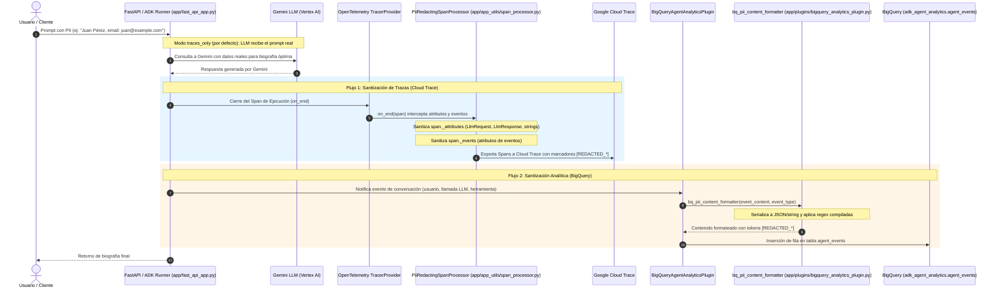

# Arquitectura del Agente (`bio-agent`) 🏛️

El agente **`bio-agent`** es una aplicación agentic construida con **Google ADK 2.0 (Agent Development Kit)**, desplegada en **Google Cloud Run** e instrumentada con observabilidad nativa para GCP.

---

## Diagrama de Arquitectura

```mermaid
graph TD
    subgraph Cliente / Interfaz
        A[curl / REST Client / CLI] -->|HTTPS + Bearer Token| B[Cloud Run: bio-agent]
    end

    subgraph Servidor FastAPI / ADK 2.0
        B --> C[FastAPI App app/fast_api_app.py]
        C --> D[ADK 2.0 Runner / Agent app/agent.py]
        D --> E[Modelo: Gemini Flash Latest]
        D --> F[Tool: Google Search Grounding]
    end

    subgraph Gestión de Sesiones
        C -->|agentengine://| G[Vertex AI Agent Platform Sessions]
        G --> H[Reasoning Engine: bio-agent-session-engine]
    end

    subgraph Telemetría y Analítica (Observabilidad)
        D -->|OpenTelemetry| I[Google Cloud Trace]
        C -->|Cloud Logging SDK| J[Google Cloud Logging]
        D -->|BigQuery Analytics Plugin| K[BigQuery: adk_agent_analytics]
        K --> L[Tabla: agent_events & Vistas BI]
    end
```

---

## Componentes Principales

### 1. Núcleo del Agente ([`app/agent.py`](app/agent.py))
- **Framework**: ADK 2.0 (`google-adk`).
- **Modelo**: `gemini-flash-latest` (vía Vertex AI).
- **Herramientas de Búsqueda**: `google_search` para fundamentación factual (grounding).
- **Plugins**: [`BigQueryAgentAnalyticsPlugin`](app/plugins/bigquery_analytics_plugin.py#L47-L80) para captura analítica en tiempo real y opcionalmente [`PiiRedactionPlugin`](app/plugins/pii_redaction_plugin.py#L38-L123) según el modo configurado.

### 2. Servidor Backend ([`app/fast_api_app.py`](app/fast_api_app.py))
- **Framework**: FastAPI wrappers de ADK (`get_fast_api_app`).
- **Endpoints Expuestos**:
  - `POST /run`: Ejecución de prompts sobre sesiones.
  - `POST /apps/app/users/{user_id}/sessions`: Creación de sesiones.
  - `GET /health` & `/version`: Verificación del servicio.
  - `POST /feedback`: Captura de retroalimentación de usuario en Cloud Logging.

### 3. Servicio de Sesiones Persistentes ([`app/app_utils/ensure_session_engine.py`](app/app_utils/ensure_session_engine.py))
- **Módulo**: `VertexAiSessionService` de ADK.
- **Detección Automática**: El script [`ensure_session_engine.py`](app/app_utils/ensure_session_engine.py) busca una instancia de Reasoning Engine con `display_name='bio-agent-session-engine'`. Si no existe, la crea la primera vez y reutiliza la URI (`agentengine://...`) en despliegues subsecuentes.

---

### 4. Arquitectura de Observabilidad y Ofuscación PII

El sistema implementa un esquema de doble barrera de ofuscación para garantizar que ningún dato de identificación personal (**PII**) sea expuesto en **Google Cloud Trace** ni persistido en texto claro en **Google BigQuery**.



#### A. Mecanismo de Ofuscación en Trazas (Cloud Trace / OpenTelemetry)
- **Ubicación del Código**:
  - Clase principal: [`PiiRedactingSpanProcessor`](app/app_utils/span_processor.py#L27-L125) en [`app/app_utils/span_processor.py`](app/app_utils/span_processor.py).
  - Inicializador e inyección: [`setup_pii_trace_redaction()`](app/app_utils/telemetry.py#L19-L48) en [`app/app_utils/telemetry.py`](app/app_utils/telemetry.py).
  - Activación en servidor: [`app/fast_api_app.py`](app/fast_api_app.py#L54-L56).
- **Cómo opera**:
  1. **Orden de los Procesadores (Prepending)**: OpenTelemetry encadena sus `_span_processors` en el `TracerProvider`. En [`setup_pii_trace_redaction()`](app/app_utils/telemetry.py#L19-L48), el procesador se inyecta como elemento cero:
     ```python
     provider._active_span_processor._span_processors = (
         processor,
     ) + tuple(provider._active_span_processor._span_processors)
     ```
     Esto garantiza que [`PiiRedactingSpanProcessor.on_end()`](app/app_utils/span_processor.py#L78-L112) se ejecute **antes** de que el exportador por lotes (`BatchSpanProcessor`) envíe los spans a GCP.
  2. **Sanitización profunda de `span._attributes`**:
     - Tipos primitivos y listas/diccionarios se recorren recursivamente con [`_redact_val()`](app/app_utils/span_processor.py#L55-L76).
     - Los objetos complejos de ADK (`LlmRequest`, `LlmResponse`), que OpenTelemetry o ADK guardan como valores de atributos, son convertidos a cadena y redactados mediante expresiones regulares, evitando fugas en atributos como `gcp.vertex.agent.llm_request` o `gen_ai.prompt`.
  3. **Sanitización de `span._events`**: Cada evento asociado al span se reconstruye con sus atributos sanitizados y el nombre del evento ofuscado.

#### B. Mecanismo de Ofuscación en BigQuery (Agent Analytics)
- **Ubicación del Código**:
  - Función de formateo: [`bq_pii_content_formatter()`](app/plugins/bigquery_analytics_plugin.py#L34-L45) en [`app/plugins/bigquery_analytics_plugin.py`](app/plugins/bigquery_analytics_plugin.py).
  - Inicializador del plugin: [`InitBigQueryAnalyticsPlugin()`](app/plugins/bigquery_analytics_plugin.py#L47-L80) en [`app/plugins/bigquery_analytics_plugin.py`](app/plugins/bigquery_analytics_plugin.py).
  - Motor de redacción: [`PiiRedactionPlugin.redact_text()`](app/plugins/pii_redaction_plugin.py#L54-L61) en [`app/plugins/pii_redaction_plugin.py`](app/plugins/pii_redaction_plugin.py).
- **Cómo opera**:
  1. **Configuración de ADK**: ADK proporciona `BigQueryAgentAnalyticsPlugin`, el cual permite desacoplar la persistencia del formato mediante `BigQueryLoggerConfig(content_formatter=...)`.
  2. **Intercepción de Eventos**: Durante la ejecución del agente, cada evento que deba asentarse en la tabla `agent_events` de BigQuery es pasado a [`bq_pii_content_formatter(event_content, event_type)`](app/plugins/bigquery_analytics_plugin.py#L34-L45).
  3. **Normalización y Redacción**:
     - Si `event_content` es un diccionario o estructura JSON, se transforma vía `json.dumps()`.
     - Si es un objeto estructurado de ADK (ej: `types.Content`), se convierte a cadena (`str(event_content)`).
     - Se invoca `_redactor.redact_text()`, que sustituye los patrones PII por marcadores seguros (`[REDACTED_EMAIL]`, etc.).
  4. **Persistencia Segura**: BigQuery recibe la columna de contenido completamente anonimizada.

#### C. Catálogo de Patrones PII Soportados
Definidos en [`DEFAULT_PII_PATTERNS`](app/plugins/pii_redaction_plugin.py#L29-L35) dentro de [`app/plugins/pii_redaction_plugin.py`](app/plugins/pii_redaction_plugin.py):
- **Email**: `[a-zA-Z0-9._%+-]+@[a-zA-Z0-9.-]+\.[a-zA-Z]{2,}` -> `[REDACTED_EMAIL]`
- **Teléfono**: `\b(?:\+?\d{1,3}[-.\s]?)?\(?\d{3}\)?[-.\s]?\d{3}[-.\s]?\d{4}\b` -> `[REDACTED_PHONE]`
- **Tarjeta de Crédito**: `\b(?:\d[ -]*?){13,16}\b` -> `[REDACTED_CREDIT_CARD]`
- **SSN**: `\b\d{3}-\d{2}-\d{4}\b` -> `[REDACTED_SSN]`
- **Dirección IP**: `\b(?:\d{1,3}\.){3}\d{1,3}\b` -> `[REDACTED_IP_ADDRESS]`

#### D. Matriz de Modos de Operación (`PII_REDACTION_MODE`)
- **`traces_only` (Predeterminado y Recomendado)**:
  - **Gemini LLM**: Recibe el texto real intacto (permite investigar biografías y generar resúmenes con alta fidelidad semántica).
  - **Cloud Trace**: Sanitizado por [`PiiRedactingSpanProcessor`](app/app_utils/span_processor.py#L27-L125).
  - **BigQuery Analytics**: Sanitizado por [`bq_pii_content_formatter`](app/plugins/bigquery_analytics_plugin.py#L34-L45).
- **`in_flight`**:
  - Se registra [`PiiRedactionPlugin`](app/plugins/pii_redaction_plugin.py#L38-L123) en la lista de plugins del agente en [`app/agent.py`](app/agent.py#L72-L73). Intercepta mensajes en vuelo antes de que el LLM los reciba.
- **`both`**:
  - Combina redacción en vuelo y redacción en exportadores (trazas y BigQuery).
- **`disabled`**:
  - Desactiva el procesador de trazas y el formateador de BigQuery.

#### E. Pruebas Unitarias Asociadas
Toda la lógica de ofuscación está cubierta y validada por pruebas unitarias automatizadas:
- Trazas OpenTelemetry: [`tests/unit/test_span_processor.py`](tests/unit/test_span_processor.py)
- Formateador BigQuery: [`tests/unit/test_bigquery_plugin.py`](tests/unit/test_bigquery_plugin.py)
- Configuración de modos: [`tests/unit/test_pii_mode_config.py`](tests/unit/test_pii_mode_config.py)
- Plugin en vuelo: [`tests/unit/test_pii_redaction_plugin.py`](tests/unit/test_pii_redaction_plugin.py)


---

## Flujo de Trabajo y Despliegue

### Automatización con `Makefile`

| Comando | Descripción |
|---|---|
| `make install` | Instala dependencias del proyecto y módulo de evaluación con `uv` |
| `make run` | Prueba el agente localmente desde la terminal |
| `make test-remote` | Ejecuta peticiones de prueba contra la revisión activa en Cloud Run |
| `make server` | Inicia el servidor FastAPI local con auto-reload |
| `make eval` | Ejecuta la suite de evaluación con LLM-as-a-judge (`biography.evalset.json`) |
| `make deploy` | Garantiza la existencia del **Reasoning Engine de Sesiones** y despliega en **Cloud Run** |
| `make clean` | Limpia artefactos y cachés temporales |
