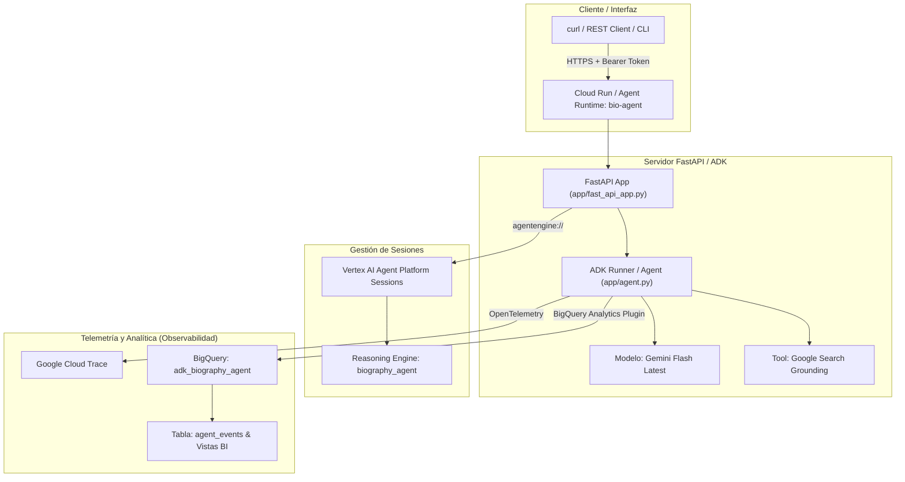
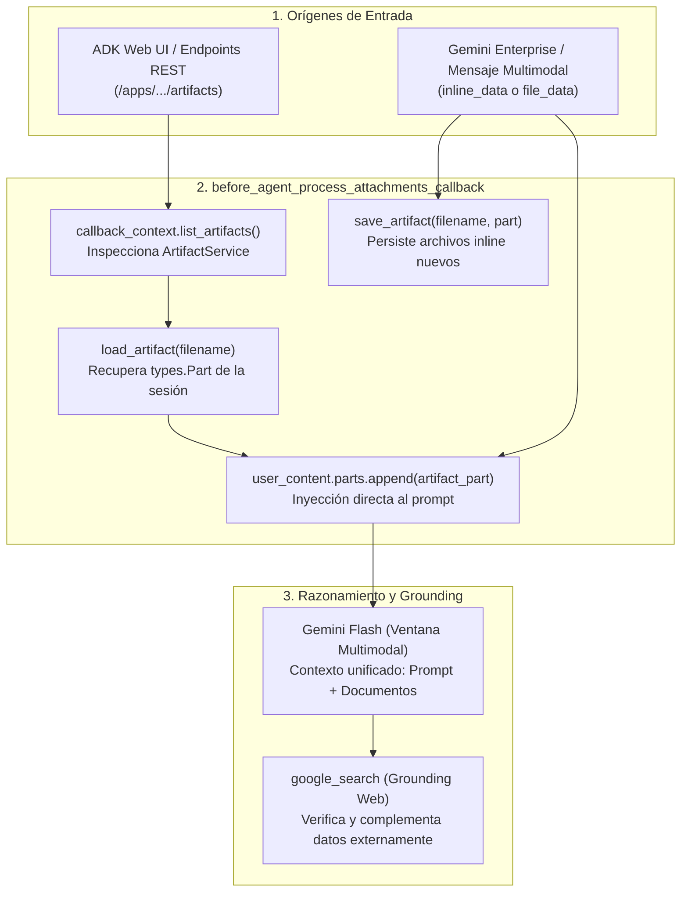
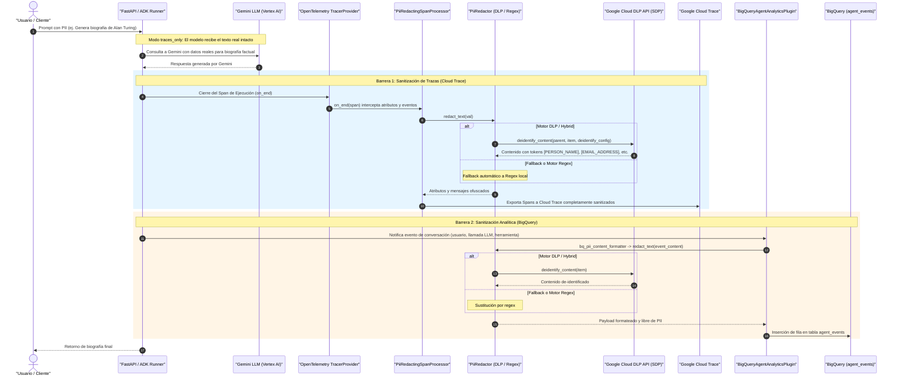

# bio-agent 🤖

Agente de investigación y generación de biografías factuales construido con **Google ADK (Agent Development Kit v1.36.0)** y preparado para **Vertex AI Agent Runtime** y **Google Cloud Run**.

> [!IMPORTANT]
> **🎯 Objetivo Principal del Proyecto**:  
> Aunque este servicio implementa un agente funcional de investigación de biografías, su **propósito arquitectónico fundamental es demostrar cómo ofuscar y proteger información sensible (PII) en las trazas distribuidas de observabilidad (Google Cloud Trace / OpenTelemetry) y en el registro de analítica conversacional (Google BigQuery)**.
> 
> El patrón de diseño implementado demuestra cómo garantizar la privacidad sin degradar la inteligencia del agente:
> 1. **Comunicación Transparente con el Modelo**: Gemini recibe las consultas reales del usuario sin ofuscar para ejecutar búsquedas web precisas (`google_search`) y generar respuestas contextualmente ricas.
> 2. **Anonimización Estricta en la Frontera de Exportación**: Tanto el procesador de OpenTelemetry ([`PiiRedactingSpanProcessor`](app/app_utils/span_processor.py)) como el formateador de analítica ([`bq_pii_content_formatter`](app/plugins/bigquery_analytics_plugin.py)) interceptan los datos antes de salir hacia **Cloud Trace** y **BigQuery**, aplicando de-identificación en tiempo real con **Google Cloud Sensitive Data Protection (SDP / Cloud DLP)** y plantillas corporativas con fallback resiliente a Regex local.

---

## 🏛️ Arquitectura del Sistema

### Diagrama General



### Estructura del Repositorio

```
bio-agent/
├── app/                        # Código principal del agente
│   ├── agent.py                # Lógica del agente, modelo Gemini y herramientas (google_search)
│   ├── fast_api_app.py         # Servidor FastAPI y configuración de endpoints de ADK
│   ├── plugins/                # Plugins de extensión y privacidad
│   │   ├── pii_redactor.py     # Motor central de redacción (Cloud DLP / SDP & Regex)
│   │   └── bigquery_analytics_plugin.py # Formateador con sanitización para BigQuery
│   └── app_utils/              # Utilidades de infraestructura y observabilidad
│       ├── reasoning_engine_adapter.py # Rutas HTTP del contrato Reasoning Engine para Gemini Enterprise
│       ├── span_processor.py   # Procesador OpenTelemetry con sanitización dirigida
│       ├── telemetry.py        # Configuración de OpenTelemetry y Cloud Trace
│       └── types_def.py        # Esquemas y tipos Pydantic
├── docs/assets/                # Evidencias visuales de ofuscación (Cloud Trace y BigQuery)
├── tests/                      # Suite de pruebas unitarias y de integración
│   ├── unit/                   # Tests unitarios (PII Redactor, Span Processor, BigQuery)
│   └── integration/            # Tests de integración del servidor FastAPI
├── Makefile                    # Automatización de operaciones y despliegue
├── .env.example                # Plantilla de variables de entorno
├── Dockerfile                  # Contenedor de producción endurecido (non-root)
└── pyproject.toml              # Gestión de dependencias con uv
```

---

## 🧩 Componentes Principales

### 1. Núcleo del Agente ([`app/agent.py`](app/agent.py))
- **Framework**: Google ADK (`google-adk` v1.36.0).
- **Modelo**: `gemini-flash-latest` (vía Vertex AI).
- **Herramientas**: `google_search` para fundamentación factual (grounding).
- **Gestión de Archivos y Artefactos**:
  - `before_agent_process_attachments_callback`: Detecta, persiste y carga archivos adjuntos.
  - Carga proactiva con `load_artifact` del ADK hacia el contexto del modelo (`user_content.parts`).
  - Persistencia automática en el `ArtifactService` mediante `save_artifact`.
  - Deduplicación inteligente para prevenir partes redundantes en la ventana de contexto.
- **Plugins**: [`BigQueryAgentAnalyticsPlugin`](app/plugins/bigquery_analytics_plugin.py) para captura de analítica conversacional sanitizada.

### 2. Servidor Backend ([`app/fast_api_app.py`](app/fast_api_app.py))
- **Framework**: FastAPI wrappers de ADK (`get_fast_api_app`).
- **Endpoints Expuestos**:
  - `POST /run`: Ejecución de prompts sobre sesiones.
  - `POST /apps/app/users/{user_id}/sessions`: Creación de sesiones.
  - `GET /health` & `/version`: Verificación del servicio.

### 3. Adaptador de Reasoning Engine ([`app/app_utils/reasoning_engine_adapter.py`](app/app_utils/reasoning_engine_adapter.py))
- **Gemini Enterprise & Vertex AI**: Expone `/api/stream_reasoning_engine` y `/api/reasoning_engine` permitiendo la integración nativa con Gemini Enterprise mediante el contrato de Reasoning Engine (`:streamQuery`).
- **Resolución Nativa de ADK**: Utiliza la gestión nativa de sesiones de `AdkApp` (`VertexAiSessionService` en producción y memoria local durante desarrollo).

---

## 📂 Gestión de Archivos Adjuntos y Artefactos (ADK & Gemini Enterprise)

El agente está diseñado para procesar documentos (PDFs, Word, texto, CVs) de manera unificada a través de dos mecanismos de entrada:



### 1. Carga Proactiva al Contexto Multimodal (`load_artifact`)
Cuando un usuario interactúa con el agente mediante la interfaz web de ADK (`adk web`) o la API REST, los archivos subidos residen en el `ArtifactService` de la sesión:
- El callback `before_agent_process_attachments_callback` lista los artefactos de la sesión (`list_artifacts()`).
- Para cada archivo disponible, invoca `await callback_context.load_artifact(key)` del ADK.
- Anexa la parte de contenido (`types.Part`) a `callback_context.user_content.parts`.
- **Ventaja**: Gemini Flash recibe el archivo en su contexto multimodal desde el primer turno sin requerir que el modelo gaste turnos de razonamiento llamando a herramientas intermedias.

### 2. Persistencia y Deduplicación (`save_artifact`)
- Cuando un archivo llega embebido directamente en el mensaje (por ejemplo, desde Gemini Enterprise como `inline_data` base64), el callback lo guarda automáticamente en el `ArtifactService` con `save_artifact(file_name, part)`.
- Se mantiene un registro de nombres procesados en el turno (`existing_file_names`) para evitar duplicar el contenido del archivo si ya estaba presente en la entrada.

### 3. Compatibilidad con el Grounding de Vertex AI
En la API de Vertex AI Gemini, existe la regla estricta:
> *"Multiple tools are supported only when they are all search tools."*

Si se mezclara una herramienta de función como `load_artifacts` con la herramienta de búsqueda `google_search` en `tools`, la API retornaría un error `400 Bad Request`.
Al realizar la carga y persistencia en el `before_agent_callback`:
- Se preserva `tools=[google_search]` limpio y 100% compatible con Vertex AI.
- Toda la manipulación de artefactos y archivos se resuelve en el ciclo de vida del agente antes de emitir la llamada al modelo.

### 4. Blindaje de PII en Archivos Grandes
El módulo [`PiiRedactor`](app/plugins/pii_redactor.py) y el [`PiiRedactingSpanProcessor`](app/app_utils/span_processor.py) filtran automáticamente los binarios base64 y limitan los bloques de texto a 500,000 caracteres, protegiendo las cuotas y latencia de Cloud DLP API cuando se adjuntan documentos extensos.

---

## 🔒 Flujo y Mecanismo de Ofuscación PII (Cloud DLP / SDP & Regex)

El sistema implementa una **doble barrera de sanitización perimetral** orquestada por el módulo [`PiiRedactor`](app/plugins/pii_redactor.py). Esto asegura que ningún dato de identificación personal (**PII**) sea expuesto en **Google Cloud Trace** ni persistido en texto claro en **Google BigQuery**, manteniendo al mismo tiempo intacto el mensaje para el razonamiento del modelo.



---

### 🛡️ Motores de Detección: Google Cloud DLP (SDP) & Regex

El sistema soporta dos motores mediante la variable `PII_ENGINE`:
1. **Google Cloud Sensitive Data Protection (Cloud DLP / SDP)**: Inspección y de-identificación profunda con aprendizaje automático y reglas corporativas de GCP.
   - Detecta por defecto: `EMAIL_ADDRESS`, `PHONE_NUMBER`, `PERSON_NAME`, `CREDIT_CARD_NUMBER`, `US_SOCIAL_SECURITY_NUMBER`, `IP_ADDRESS`.
   - Ofusca con marcadores estándar de DLP: `[EMAIL_ADDRESS]`, `[PHONE_NUMBER]`, `[PERSON_NAME]`, etc.
   - Soporte opcional para plantillas de de-identificación corporativas (`DLP_DEIDENTIFY_TEMPLATE`).
2. **Motor Regex Local**: Detecta patrones regulares sin coste de API ni latencia de red.
   - Patrones definidos en [`DEFAULT_PII_PATTERNS`](app/plugins/pii_redactor.py):
     - Correos: `[EMAIL_ADDRESS]` o `[REDACTED_EMAIL]`
     - Teléfonos: `[PHONE_NUMBER]` o `[REDACTED_PHONE]`
     - Tarjetas: `[CREDIT_CARD_NUMBER]` o `[REDACTED_CREDIT_CARD]`
     - SSN: `[US_SOCIAL_SECURITY_NUMBER]` o `[REDACTED_SSN]`
     - IP: `[IP_ADDRESS]` o `[REDACTED_IP_ADDRESS]`
3. **Modo Híbrido (`hybrid` - Predeterminado)**: Intenta de-identificar usando Cloud DLP en Google Cloud; si la API no está accesible (ej. desarrollo local o fallo transitorio), activa un fallback automático e inmediato a Regex para no interrumpir el flujo.

---

### 🔍 1. ¿Cómo funciona la Ofuscación en las Trazas (Cloud Trace / OpenTelemetry)?

Cuando el agente se ejecuta en Cloud Run o Agent Runtime, **ADK** y **FastAPI** instrumentan automáticamente las llamadas usando OpenTelemetry (`otel_to_cloud=True`). Para permitir la observabilidad completa del contenido conversacional sin filtrar PII:
1. **Captura Completa de Contenido**: Se habilita `OTEL_INSTRUMENTATION_GENAI_CAPTURE_MESSAGE_CONTENT=SPAN_AND_EVENT` y `ADK_CAPTURE_MESSAGE_CONTENT_IN_SPANS=true`.
2. **Inyección Prioritaria (Prepending)**: La función [`setup_pii_trace_redaction()`](app/app_utils/telemetry.py#L19-L48) antepone [`PiiRedactingSpanProcessor`](app/app_utils/span_processor.py) como el primer elemento en `provider._active_span_processor._span_processors`.
3. **Ejecución Antes de Exportadores**: Su método `on_end(span)` se ejecuta **antes** de que el exportador por lotes (`BatchSpanProcessor`) envíe los datos a Cloud Trace.
4. **Sanitización Dirigida**: Evalúa únicamente atributos de contenido (`gen_ai.prompt`, `gen_ai.completion`, `gcp.vertex.agent.llm_request`, `events`), sustituyendo cualquier PII por su marcador antes de exportar.


Archivos clave:
- Procesador OpenTelemetry (sanitización dirigida): [`app/app_utils/span_processor.py`](app/app_utils/span_processor.py)
- Motor centralizado de redacción: [`app/plugins/pii_redactor.py`](app/plugins/pii_redactor.py)
- Registro e inicialización de telemetría: [`app/app_utils/telemetry.py`](app/app_utils/telemetry.py)
- Pruebas unitarias: [`tests/unit/test_span_processor.py`](tests/unit/test_span_processor.py)

---

### 📊 2. ¿Cómo funciona la Ofuscación en BigQuery (Agent Analytics)?

El agente utiliza `BigQueryAgentAnalyticsPlugin` para registrar analítica de sesiones en la tabla `agent_events` del dataset configurado:
1. **Configuración de Formateador Personalizado**: En [`InitBigQueryAnalyticsPlugin()`](app/plugins/bigquery_analytics_plugin.py), se configura `BigQueryLoggerConfig` pasando [`bq_pii_content_formatter`](app/plugins/bigquery_analytics_plugin.py).
2. **Interceptación de Eventos**: Cada evento (mensaje de usuario, solicitud/respuesta al LLM, ejecución de herramientas) se intercepta antes de enviarse a BigQuery.
3. **Redacción Textual**: Se delega en [`_redactor.redact_text()`](app/plugins/pii_redactor.py) con Cloud DLP o fallback a Regex.
4. **Persistencia Segura**: BigQuery almacena la fila con el contenido debidamente anonimizado.


Archivos clave:
- Plugin e inicializador BigQuery: [`app/plugins/bigquery_analytics_plugin.py`](app/plugins/bigquery_analytics_plugin.py)
- Motor de redacción (Cloud DLP & Regex): [`app/plugins/pii_redactor.py`](app/plugins/pii_redactor.py)
- Pruebas unitarias: [`tests/unit/test_bigquery_plugin.py`](tests/unit/test_bigquery_plugin.py) y [`tests/unit/test_pii_redactor.py`](tests/unit/test_pii_redactor.py)

---

### ⚙️ Modos y Variables de Configuración

| Variable | Opciones / Tipo | Descripción |
|---|---|---|
| `ENABLE_PII_REDACTION` | `true` / `false` | Habilita o deshabilita globalmente la redacción. |
| `PII_REDACTION_MODE` | `traces_only` | **(Recomendado - Predeterminado)** Gemini recibe la información real intacta; Cloud Trace y BigQuery reciben datos 100% ofuscados. |
| | `disabled` | Desactiva toda redacción. |
| `PII_ENGINE` | `hybrid` / `dlp` / `regex` | **(Predeterminado: `hybrid`)** Selecciona el motor de ofuscación: Cloud DLP con fallback, exclusivo Cloud DLP, o solo Regex. |
| `DLP_LOCATION` | `string` | Región para Cloud DLP API (por defecto `us-central1`). |
| `DLP_DEIDENTIFY_TEMPLATE` | `string` | *(Opcional)* Nombre o ID corto de la plantilla de de-identificación en GCP (ej: `agent-template`). |
| `DLP_INFO_TYPES` | `string` | Lista de detectores DLP separados por comas. |

---

## 🚀 Comandos Rápidos (`Makefile`)

```bash
# Ver menú de ayuda con todos los comandos
make help
```

| Comando | Descripción |
|---|---|
| `make install` | Instala dependencias del proyecto usando `uv` |
| `make run` | Prueba rápida del agente en la terminal (`make run PROMPT="..."`) |
| `make test` | Ejecuta las pruebas unitarias e integración con pytest |
| `make server` | Servidor FastAPI local en `http://localhost:8000` |
| `make playground` | Interfaz web interactiva (ADK Web Playground) |
| `make eval` | Ejecuta la evaluación con juez LLM |
| `make deploy` | Despliega el agente en **Vertex AI Agent Runtime (Agent Engine)** |
| `make publish-gemini-enterprise` | Publica o actualiza el agente en **Gemini Enterprise** |
| `make clean` | Limpia artefactos y cachés temporales |

---

## ⚙️ Variables de Entorno (`.env`)

Copia la plantilla `.env.example` a `.env` y configura tus credenciales:

```bash
cp .env.example .env
```

Variables clave:
- `GOOGLE_CLOUD_PROJECT`: ID del proyecto en GCP (`gke-service-project-081292`)
- `GOOGLE_CLOUD_LOCATION`: Región GCP (`us-central1`)
- `BQ_ANALYTICS_DATASET_ID`: Dataset de analítica en BigQuery (`adk_biography_agent`)
- `PII_ENGINE`: Motor de ofuscación (`hybrid`, `dlp`, `regex`)
- `DLP_DEIDENTIFY_TEMPLATE`: Plantilla de de-identificación (`agent-template`)
