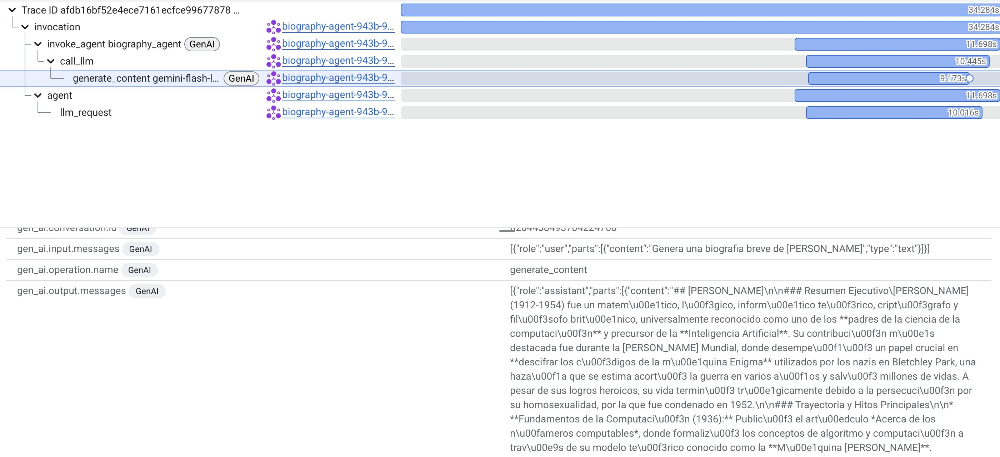
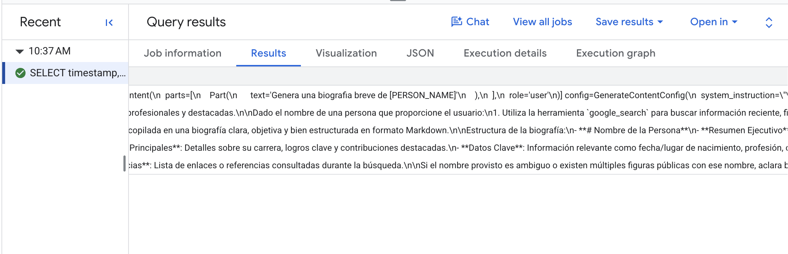

# bio-agent 🤖

Agente de investigación y generación de biografías factuales construido con **Google ADK 2.0 (Agent Development Kit)** y preparado para **Google Cloud Run**.

> [!IMPORTANT]
> **🎯 Objetivo Principal del Proyecto**:  
> Aunque este servicio implementa un agente funcional de investigación de biografías, su **propósito arquitectónico fundamental es demostrar cómo ofuscar y proteger información sensible (PII) en las trazas distribuidas de observabilidad (Google Cloud Trace / OpenTelemetry) y en el registro de analítica conversacional (Google BigQuery)**.
> 
> El patrón de diseño implementado demuestra cómo garantizar la privacidad sin degradar la inteligencia del agente:
> 1. **Comunicación Transparente con el Modelo**: Gemini recibe las consultas reales del usuario sin ofuscar para ejecutar búsquedas web precisas (`google_search`) y generar respuestas contextualmente ricas.
> 2. **Anonimización Estricta en la Frontera de Exportación**: Tanto el procesador de OpenTelemetry ([`PiiRedactingSpanProcessor`](app/app_utils/span_processor.py)) como el formateador de analítica ([`bq_pii_content_formatter`](app/plugins/bigquery_analytics_plugin.py)) interceptan los datos antes de salir hacia **Cloud Trace** y **BigQuery**, aplicando de-identificación en tiempo real con **Google Cloud Sensitive Data Protection (SDP / Cloud DLP)** y plantillas corporativas con fallback resiliente a Regex local.


---

## 🏛️ Arquitectura del Sistema

Consulta la documentación detallada y diagramas en **[ARCHITECTURE.md](ARCHITECTURE.md)**.

```
bio-agent/
├── app/                        # Código principal del agente
│   ├── agent.py                # Lógica principal y herramientas (google_search)
│   ├── fast_api_app.py         # Servidor FastAPI y configuración de endpoints
│   └── app_utils/              # Gestión de sesiones y utilidades
│       ├── ensure_session_engine.py # Aprovisionamiento automático de Vertex AI Session Service
│       ├── telemetry.py        # Configuración de OpenTelemetry y Cloud Trace
│       └── types_def.py        # Definición de esquemas pydantic
├── tests/                      # Suite de pruebas unitarias y evalsets
│   └── eval/                   # Pruebas de evaluación con juez LLM
├── examples/                   # Ejemplos de uso (gestión de sesiones)
├── ARCHITECTURE.md             # Especificación técnica y diagramas de arquitectura
├── Makefile                    # Automatización de operaciones
├── .env.example                # Plantilla de variables de entorno
├── Dockerfile                  # Contenedor de producción
└── pyproject.toml              # Gestión de dependencias con uv
```

---

## 🚀 Comandos Rápidos (`Makefile`)

El proyecto incluye un `Makefile` para gestionar todo el ciclo de desarrollo y operaciones:

```bash
# Ver menú de ayuda con todos los comandos
make help
```

| Comando | Descripción |
|---|---|
| `make install` | Instala dependencias del proyecto usando `uv` |
| `make run` | Prueba rápida del agente en la terminal (`make run PROMPT="..."`) |
| `make test-remote` | Prueba el agente desplegado en Cloud Run |
| `make server` | Servidor FastAPI local en `http://localhost:8000` |
| `make playground` | Interfaz web interactiva (ADK Web Playground) |
| `make eval` | Ejecuta la evaluación con juez LLM |
| `make deploy` | Garantiza el Session Engine y despliega en **Cloud Run** |

---

## ⚙️ Variables de Entorno (`.env`)

Copia la plantilla `.env.example` a `.env` y configura tus credenciales:

```bash
cp .env.example .env
```

Variables clave:
- `GOOGLE_CLOUD_PROJECT`: ID del proyecto en GCP (`gke-service-project-081292`)
- `GOOGLE_CLOUD_LOCATION`: Región GCP (`us-central1`)
- `AGENT_ENGINE_ID`: ID del Reasoning Engine para sesiones en Vertex AI
- `BQ_ANALYTICS_DATASET_ID`: Dataset de analítica en BigQuery (`adk_agent_analytics`)

---

## 🔒 Redacción y Ofuscación de Datos Sensibles (PII Redaction con Cloud DLP / SDP)

El agente incorpora un mecanismo de seguridad y privacidad desacoplado a través del módulo [`PiiRedactor`](app/plugins/pii_redactor.py), diseñado para detectar y ofuscar información de identificación personal (**PII**) antes de ser persistida en BigQuery o exportada a Cloud Trace.

### 🛡️ Motores de Detección: Google Cloud DLP (SDP) & Regex
El sistema soporta dos motores mediante la variable `PII_ENGINE`:
1. **Google Cloud Sensitive Data Protection (Cloud DLP / SDP)**: Inspección y de-identificación profunda con aprendizaje automático y reglas corporativas de GCP.
   - Detecta por defecto: `EMAIL_ADDRESS`, `PHONE_NUMBER`, `PERSON_NAME`, `CREDIT_CARD_NUMBER`, `US_SOCIAL_SECURITY_NUMBER`, `IP_ADDRESS`.
   - Ofusca con marcadores estándar de DLP: `[EMAIL_ADDRESS]`, `[PHONE_NUMBER]`, `[PERSON_NAME]`, etc.
   - Soporte opcional para plantillas de de-identificación (`DLP_DEIDENTIFY_TEMPLATE`).
2. **Motor Regex Local**: Detecta patrones regulares sin coste de API ni latencia de red.
   - Patrones definidos en [`DEFAULT_PII_PATTERNS`](app/plugins/pii_redactor.py):
     - Correos: `[EMAIL_ADDRESS]` o `[REDACTED_EMAIL]`
     - Teléfonos: `[PHONE_NUMBER]` o `[REDACTED_PHONE]`
     - Tarjetas: `[CREDIT_CARD_NUMBER]` o `[REDACTED_CREDIT_CARD]`
     - SSN: `[US_SOCIAL_SECURITY_NUMBER]` o `[REDACTED_SSN]`
     - IP: `[IP_ADDRESS]` o `[REDACTED_IP_ADDRESS]`
3. **Modo Híbrido (`hybrid` - Predeterminado)**: Intenta de-identificar usando Cloud DLP en Google Cloud; si la API no está accesible (ej. desarrollo local o fallo transitorio), activa un fallback automático e inmediato a Regex para no interrumpir el flujo.

---

### 🔍 1. ¿Cómo funciona la Ofuscación en las Trazas (Cloud Trace / OpenTelemetry)?

Cuando el agente se ejecuta en Cloud Run, **ADK 2.0** y **FastAPI** instrumentan automáticamente las llamadas usando OpenTelemetry (`otel_to_cloud=True`). Sin un procesador de sanitización, las consultas del usuario y respuestas del modelo que contienen datos sensibles serían visibles en texto plano en la consola de **Google Cloud Trace**.

Para evitar esto:
1. **Inyección Prioritaria**: La función [`setup_pii_trace_redaction()`](app/app_utils/telemetry.py#L19-L48) en [`app/app_utils/telemetry.py`](app/app_utils/telemetry.py) obtiene el `TracerProvider` activo y antepone una instancia de [`PiiRedactingSpanProcessor`](app/app_utils/span_processor.py#L27-L125) al inicio de la lista `_span_processors`.
2. **Ejecución Antes de Exportadores**: Al estar ubicado como el primer procesador de la cadena, su método [`on_end(span)`](app/app_utils/span_processor.py#L78-L112) se ejecuta **antes** de que el exportador por lotes (`BatchSpanProcessor` / `CloudTraceSpanExporter`) serialice y envíe los spans a Google Cloud Trace.
3. **Sanitización Dirigida de Atributos y Eventos**:
   - Para maximizar la eficiencia y reducir llamadas innecesarias a Cloud DLP, [`PiiRedactingSpanProcessor`](app/app_utils/span_processor.py) filtra selectivamente solo los atributos que contienen texto del usuario y respuestas del LLM (`gen_ai.prompt`, `gen_ai.completion`, `gcp.vertex.agent.llm_request`, `events`, etc.), omitiendo metadatos técnicos de OpenTelemetry.
   - Sanea atributos recursivamente mediante [`_redact_val()`](app/app_utils/span_processor.py) delegando en [`PiiRedactor.redact_text()`](app/plugins/pii_redactor.py).
   - Reconstruye cada objeto `Event` saneando tanto el nombre del evento como todos sus atributos asociados.
4. **Resultado en Cloud Trace**: Los desarrolladores y auditores de observabilidad ven la jerarquía completa de spans, latencias y llamadas a herramientas, pero cualquier dato privado aparece como `[EMAIL_ADDRESS]`, `[PHONE_NUMBER]`, etc.



Archivos clave:
- Procesador OpenTelemetry (sanitización dirigida): [`app/app_utils/span_processor.py`](app/app_utils/span_processor.py)
- Motor centralizado de redacción: [`app/plugins/pii_redactor.py`](app/plugins/pii_redactor.py)
- Registro e inicialización de telemetría: [`app/app_utils/telemetry.py`](app/app_utils/telemetry.py)
- Pruebas unitarias: [`tests/unit/test_span_processor.py`](tests/unit/test_span_processor.py)

---

### 📊 2. ¿Cómo funciona la Ofuscación en BigQuery (Agent Analytics)?

El agente utiliza el plugin oficial de ADK `BigQueryAgentAnalyticsPlugin` para registrar analítica de sesiones y eventos conversacionales en la tabla `agent_events` del dataset configurado (por defecto `adk_agent_analytics`).

Para asegurar que los logs persistidos en BigQuery no guarden PII sin anonimizar:
1. **Configuración de Formateador Personalizado**: En [`InitBigQueryAnalyticsPlugin()`](app/plugins/bigquery_analytics_plugin.py#L47-L80) dentro de [`app/plugins/bigquery_analytics_plugin.py`](app/plugins/bigquery_analytics_plugin.py), se configura `BigQueryLoggerConfig` pasando el formateador [`bq_pii_content_formatter`](app/plugins/bigquery_analytics_plugin.py#L34-L45).
2. **Interceptación de Contenido**: Cada vez que el agente registra un evento (mensaje de usuario, solicitud o respuesta al LLM, ejecución de herramientas):
   - Si el contenido es un diccionario, se serializa con `json.dumps()`.
   - Si es un objeto de ADK/GenAI (como `types.Content`), se convierte a cadena.
3. **Redacción Textual**: Se invoca [`_redactor.redact_text()`](app/plugins/pii_redactor.py), que ejecuta la de-identificación con Cloud DLP (SDP) o el motor Regex fallback.
4. **Inserción en BigQuery**: El plugin de ADK envía el payload ya sanitizado al servicio de streaming insert de BigQuery.



Archivos clave:

- Plugin e inicializador BigQuery: [`app/plugins/bigquery_analytics_plugin.py`](app/plugins/bigquery_analytics_plugin.py)
- Motor de redacción (Cloud DLP & Regex): [`app/plugins/pii_redactor.py`](app/plugins/pii_redactor.py)
- Pruebas unitarias: [`tests/unit/test_bigquery_plugin.py`](tests/unit/test_bigquery_plugin.py) y [`tests/unit/test_pii_redactor.py`](tests/unit/test_pii_redactor.py)

---

### ⚙️ Modos y Variables de Configuración

| Variable | Opciones / Tipo | Descripción |
|---|---|---|
| `ENABLE_PII_REDACTION` | `true` / `false` | Habilita o deshabilita globalmente el sistema de redacción. |
| `PII_REDACTION_MODE` | `traces_only` | **(Recomendado - Predeterminado)** Gemini recibe la información real intacta para procesar búsquedas y biografías con precisión, mientras que las trazas a **Cloud Trace** y los registros de **BigQuery Analytics** se guardan 100% ofuscados. |
| | `in_flight` | Activa [`PiiRedactionPlugin`](app/plugins/pii_redactor.py) en el ciclo de callbacks de ADK; ofusca los datos antes de que lleguen al modelo Gemini. |
| | `both` | Aplica redacción tanto en vuelo (LLM request/response) como en la exportación a Cloud Trace y BigQuery. |
| | `disabled` | Desactiva toda redacción. |
| `PII_ENGINE` | `hybrid` / `dlp` / `regex` | **(Predeterminado: `hybrid`)** Selecciona el motor de ofuscación: Cloud DLP con fallback, exclusivo Cloud DLP, o solo Regex. |
| `DLP_LOCATION` | `string` | Región para Cloud DLP API (por defecto `global`). |
| `DLP_INFO_TYPES` | `string` | Lista separada por comas de detectores DLP (por defecto `EMAIL_ADDRESS,PHONE_NUMBER,PERSON_NAME,...`). |
| `DLP_DEIDENTIFY_TEMPLATE` | `string` | *(Opcional)* Identificador completo de plantilla de de-identificación en GCP. |


---


